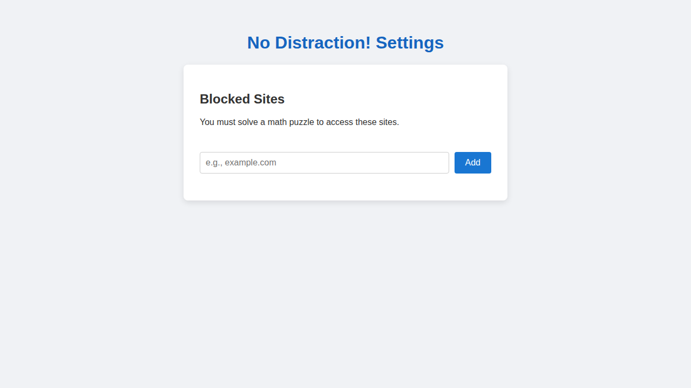
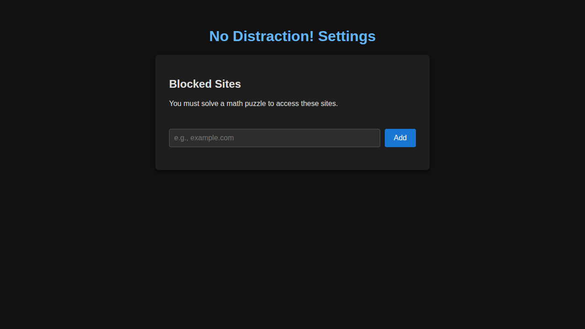
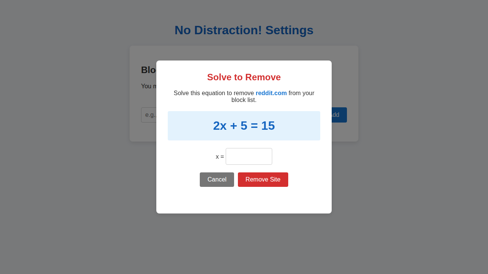
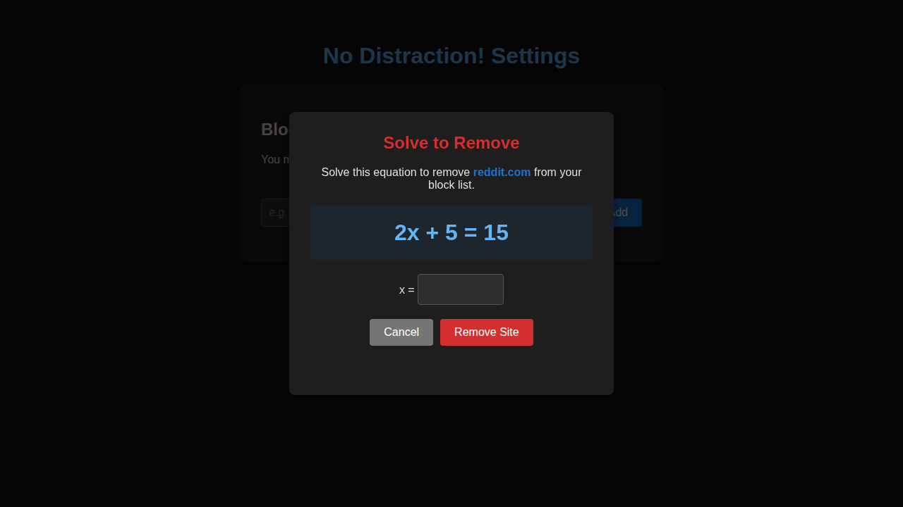

# No Distraction!

A Chromium-based browser extension designed to help you stay focused by blocking distracting websites while you work.

## Features
- **Block Distracting Sites**: Prevent access to sites like Facebook, Twitter, YouTube, and more.
- **Math Puzzle Unlock**: Need to temporarily access a blocked site? Solve a random linear equation (e.g., `3x + 5 = 14`) to unlock the site for 15 minutes.
- **Customizable Block List**: Easily add or remove sites from your block list through the extension's options page.
- **Puzzle for Removal**: To prevent impulsive removal of blocked sites, you must solve a math puzzle before a site can be removed from your block list.
- **Dark Mode Support**: The options and puzzle pages automatically adapt to your system's dark or light theme.

## Installation
Load the extension as an unpacked extension in your Chromium-based browser:
1. Go to `chrome://extensions/` or `edge://extensions/`.
2. Enable "Developer mode".
3. Click "Load unpacked" and select the extension directory.

## Screenshots

### Settings Page

### Removal Puzzle Modal

Stay productive and eliminate distractions!
